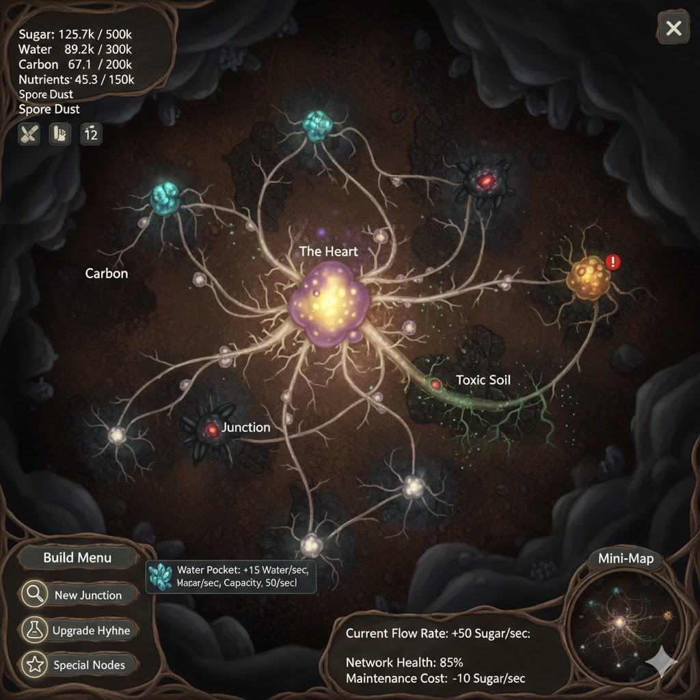

Show me a mock ui and graphics for the mycelial empire

Okay, let's visualize the "Mycelial Empire" UI and some in-game graphics. I'll focus on the main gameplay screen.

Here's a mock-up of the Mycelial Empire UI:

The game would be presented with a dark, earthy aesthetic, reflecting the underground nature of the fungal colony.

[IMAGE DESCRIPTION]

A stylized game UI for "Mycelial Empire." The main screen shows a dark, subterranean environment with glowing fungal networks.

Top Left: Resource Display

Sugar: 125.7k / 500k

Water: 89.2k / 300k

Carbon: 67.1k / 200k

Nutrients: 45.3k / 150k

Spore Dust: 12 (Prestige Currency)

Center (Main Game Area):

Background: Dark brown and grey soil textures with subtle shimmering mineral veins.

The Heart (Core Node): A large, pulsating bioluminescent mushroom-like structure, centrally located.

Hyphae (Edges): Glowing, intricate lines connecting nodes, varying in thickness to indicate resource flow. Thicker segments are "main" routes, thinner ones are exploratory. Some segments might pulse softly, indicating active resource transfer.

Resource Pockets (Nodes):

Water Pocket: A small, iridescent blue-green node, like a drop of water suspended in roots.

Carbon Pocket: A dark, crystalline node, almost like charcoal, with faint red internal glow.

Nutrient Pocket: A lumpy, organic-looking node with warm yellow-orange highlights.

Junction Nodes: Smaller, multi-limbed fungal nodes where multiple hyphae converge, glowing softly white.

Toxic Soil: A dark, corrupted area with sickly green tendrils and cracks, disrupting a hyphae path.

Unexplored Fog: Darker, less detailed areas representing parts of the map yet to be explored by hyphae.

Bottom Left (Build Menu):

Explore: Button with a magnifying glass icon.

New Junction: Button with a small mushroom icon.

Upgrade Hyphae: Button with an arrow icon.

Research: Button with a beaker icon.

Special Nodes: Button with a star icon.

Bottom Right (Mini-Map / Statistics):

A small, simplified version of the main game area, showing the overall network layout.

Current Flow Rate: +50 Sugar/sec

Network Health: 85% (affected by toxic areas or decay)

Maintenance Cost: -10 Sugar/sec

Tooltips:

Hovering over a node or hyphae would show detailed stats (e.g., "Water Pocket: +15 Water/sec, Capacity: 50/sec").

A small alert icon might pop up next to the "Toxic Soil" area, indicating a problem.

Here's the visual:

