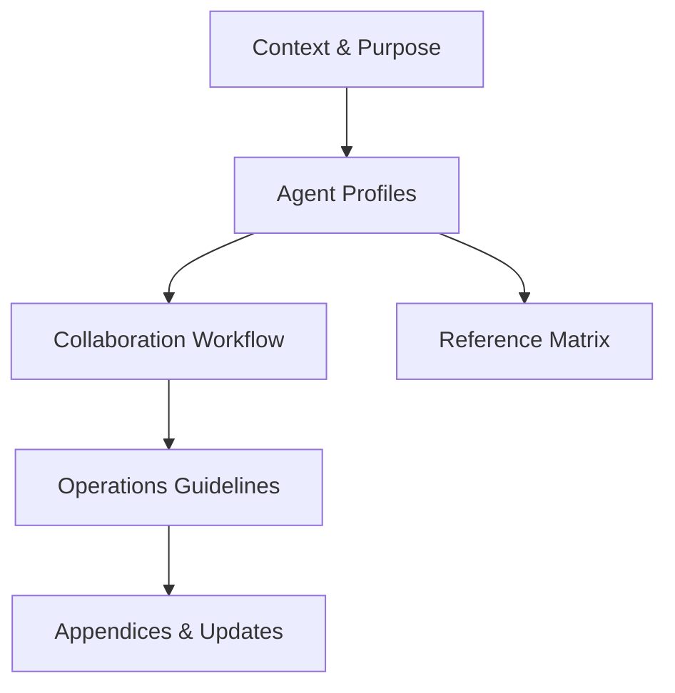

# DES001 — AGENTS.md Reference Design

## Overview

`AGENTS.md` documents the autonomous contributors that operate inside this repository so humans and other agents can understand responsibilities, collaboration rules, and dependency touchpoints. The document extends the Spec-Driven Workflow’s instruction set with actionable per-agent details, onboarding guidance, and reference links.

## Requirements Mapping

| Requirement | Design Response |
| ----------- | ---------------- |
| R1 | Define a reusable agent profile structure with mission, scope, and skills blocks. |
| R2 | Include a collaboration workflow section that explains handoffs, shared artifacts, and notification triggers. |
| R3 | Add a reference matrix mapping agents to instruction and memory files they maintain or depend upon. |
| R4 | Provide an onboarding & operations checklist that captures tools, commands, guardrails, and escalation steps. |

## Architecture

- **Context & Purpose** — Explains why AGENTS.md exists and how it supports Spec-Driven workflow participants.
- **Agent Profiles** — One subsection per agent with standardized fields (Goal, Scope, Strengths, Owned Artifacts, Contact/Handoff cues).
- **Collaboration Workflow** — Narrative + bullet list describing coordination (who hands off what, how tasks move through memory).
- **Operations Guidelines** — Checklist/table for onboarding, allowed commands, risk escalations, and validation requirements.
- **Reference Matrix** — Table linking each agent to relevant instructions and memory locations.
- **Appendices** — Versioning info, change log, and pointers for adding new agents.

## Data Flow

1. Maintainers or new agents open AGENTS.md to identify their role.
2. They follow links to `.github/instructions/*.md` or `memory/*` files as listed in the reference matrix.
3. Task execution updates are pushed into the Memory Bank (tasks, designs, requirements) per the collaboration workflow.
4. Future updates to AGENTS.md append entries to the change log, ensuring reproducible onboarding history.

## Interfaces & Data Models

- **Agent Profile Template**
  - `Name`
  - `Mission Statement`
  - `Primary Responsibilities`
  - `Core Skills / Tools`
  - `Owned Artifacts`
  - `Collaboration Hooks` (events that trigger communication)
  - `Guardrails`
  - `Reference Links`
  - `Contact / Escalation`

- **Collaboration Workflow**
  - Sequence list describing Analyze → Design → Implement → Validate → Reflect → Handoff ownership.
  - Swimlane table mapping responsibilities per phase.

- **Onboarding Checklist**
  - Table with columns: `Step`, `Description`, `Owner`, `Verification`.

## Implementation Tasks

1. Create `AGENTS.md` with the architecture above.
2. Populate at least two agent profiles (e.g., Build Agent, Research Agent) to illustrate usage.
3. Define collaboration workflow anchored to the Spec-Driven loop.
4. Document onboarding checklist and update instructions on how to add/remove agents.
