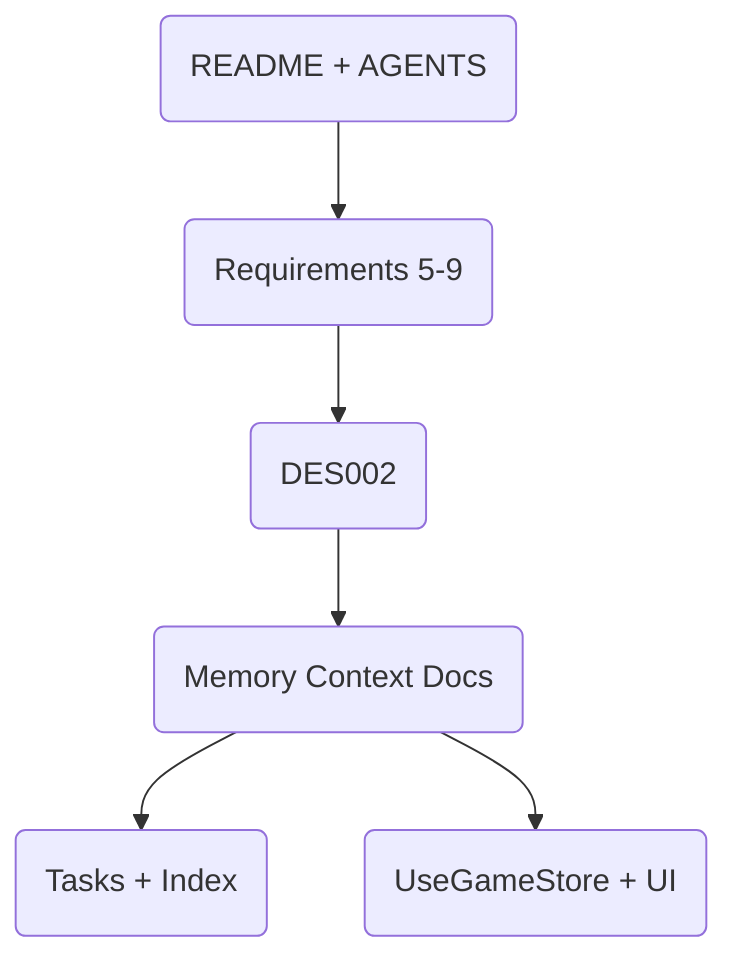

# DES002 — Memory Context Foundations

## Overview

The Spec-Driven Workflow relies on a set of foundational artifacts inside `/memory` (brief, product, system, tech, active, progress) so collaborators can quickly understand the game’s mission, experience goals, architecture, tooling, and current state. This design describes how those files interlock to satisfy requirements 5–9 and remain discoverable for future agents.

## Requirements Mapping

| Requirement | Design Response |
| ----------- | --------------- |
| R5 | `projectbrief.md` captures mission, scope, constraints, and success indicators drawn from the README and AGENTS context. |
| R6 | `productContext.md` tells the product story, key personas, problems solved, and acceptance checks. |
| R7 | `systemPatterns.md` diagrams the layered architecture (stores → ECS → renderer) and lists the patterns (central store, ECS synchronization, toast events). |
| R8 | `techContext.md` lists stack decisions, automation commands, and known constraints such as relying on Vite + React 19 and local storage autosaves. |
| R9 | `activeContext.md` + `progress.md` surface current priorities, recent decisions, working assumptions, and outstanding risks for rapid onboarding. |

## Architecture

- **README + AGENTS** provide the raw inspiration; requirements translate that into expectations for new files.
- **DES002** connects requirements to deliverables and ensures data flow is traceable.
- **Memory Context Docs** include the six new Markdown files described below.
- **Tasks + Index** reference the creation process so collaborators can find the work log.

## Data Flow

1. Requirements (R5–R9) inform the content of each context doc.
2. DES002 defines sections, tone, and relationships between docs.
3. Each doc consumes repository details (stack, architecture, pending work) and publishes a curated story.
4. `memory/tasks/TASK002` captures the implementation, and `memory/tasks/_index.md` highlights the status.
5. Future agents read these docs during onboarding and link back to AGENTS/requirements/design references.

## Interfaces & Data Models

- `projectbrief.md`: fields for mission, scope, boundaries, key metrics, and success checks.
- `productContext.md`: sections on problem space, target personas, experience goals, and value proposition.
- `systemPatterns.md`: architecture overview, component map, pattern list, and observability hooks.
- `techContext.md`: stack list, workflow commands, environment notes, and constraints.
- `activeContext.md`: current focus, recent changes, decisions, and next steps.
- `progress.md`: working features, remaining work, known issues, and confidence notes.

## Implementation Tasks

1. Add new entries to `memory/requirements.md` (R5–R9) to justify the docs.
2. Generate each context doc with consistent headers that mirror the interface list above.
3. Reference the new docs inside `TASK002` and the tasks index for traceability.
4. Update `DES002` if additional adjustments are required after validation.
